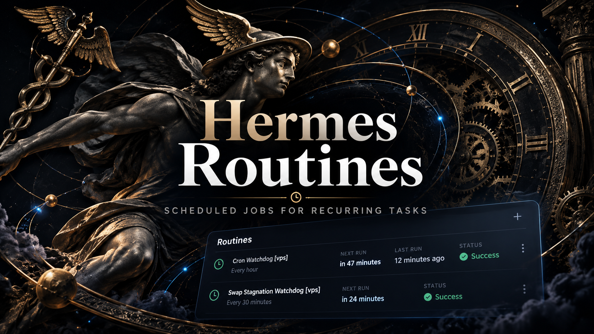
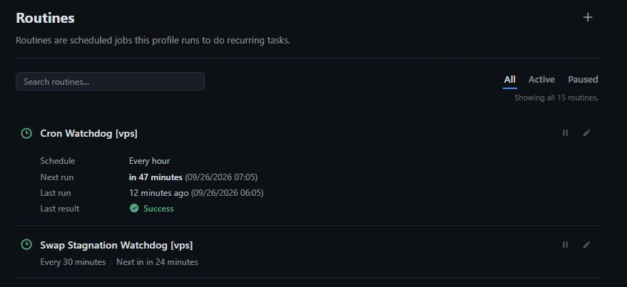
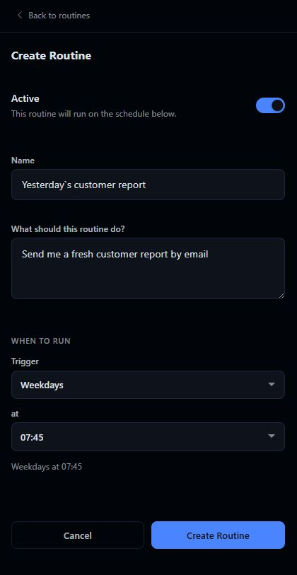
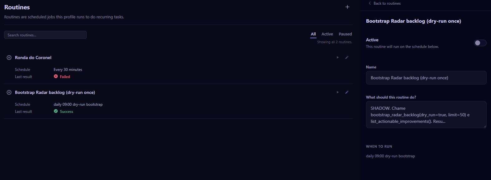

# hermes-routines

[](LICENSE)
[](../../releases/tag/v0.1.0)

> **Community plugin.** This is an independent, community-maintained plugin.
> It is not an official Nous Research product and is not endorsed by them.
> It installs through the Hermes Desktop plugin surface; review the source
> and the [security notes](#security-and-privacy) before installing.

A standalone Hermes Desktop plugin that adds a **Routines** page at `/routines` — with a matching sidebar entry — for managing scheduled routines through the host's per-profile `cron.manage` API. Routine data stays in the Hermes host; this package ships no separate service, database, or update mechanism.



*Cover image — hermes-routines for Hermes Desktop.*

## Quick navigation

- [What it does](#what-it-does)
- [Screenshots](#screenshots)
- [Quick install](#quick-install)
- [Usage](#usage)
- [Requirements](#requirements)
- [Installation](#installation)
- [Upgrade](#upgrade)
- [Uninstall](#uninstall)
- [Security and privacy](#security-and-privacy)
- [Troubleshooting](#troubleshooting)
- [Development](#development)
- [Project layout](#project-layout)
- [License](#license)

## What it does

Manage scheduled routines for the active Hermes profile from inside Hermes Desktop — no separate service or dashboard.

Supported:

- View routines for the active Hermes profile.
- Search and filter the routine list.
- Inspect the schedule and stored run instruction for each routine.
- Create a routine from a name, schedule, and prompt.
- Pause and resume existing routines.
- Use fail-closed profile routing: calls without a resolved profile route are
  rejected instead of being sent to an unintended gateway.
- Build a deterministic, auditable `desktop/plugin.js` artifact with no
  bundled runtime dependencies.

Limits:

- The current page intentionally provides no delete, edit-mutation, or run-now
  actions — the row Details control only opens the read-only inspector.
- Routine rows never expand. Selecting one marks it and opens the inspector,
  which is the single home for schedule, next run, last run and last result;
  the row keeps a one-line summary that never wraps.
- The routine backend exposes exactly five `cron.manage` actions — list, add,
  remove, pause, and resume — with no update and no run action.
- The inspector panel is a disabled, read-only mirror of the composer: it
  reflects the selected routine but offers no editable controls. Below the
  configuration it shows a separated, read-only `LAST EXECUTION` block with
  the latest run, its outcome, the failure reason when the run failed, and
  the next run while the routine can still fire.

## Screenshots

The images below are captures of the plugin running inside Hermes Desktop. Routine names, schedules, and prompts shown are examples.



*Routines list — browse, search, and filter routines for the active profile.*



*Composer — create a routine from a name, schedule, and prompt, where results go, or hand the draft to Hermes to finish. This capture predates the composer reframe in issue #72, where **Finish with Hermes** became a card beside the final actions and creation-time state was worded **Start enabled**, and the **Advanced → Delivery** override in issue #73, which became **Results** — a picker that asks where results should go and offers only destinations the profile can actually reach.*



*Inspector — the selected routine's schedule and stored instruction, shown read-only beside the list.*

## Quick install

Install it with the Hermes plugin manager:

```sh
hermes plugins install crdesign8/hermes-routines
```

That resolves this repository directly. It is marked as a custom,
unreviewed source until it is listed in the official catalog, so the
security scan runs and the install may ask you to confirm. To pin an
exact commit, add `--ref` followed by a full 40-character commit SHA.

Prefer to build it yourself? The manual path:

```sh
git clone https://github.com/crdesign8/hermes-routines.git
cd hermes-routines
npm ci
npm run build
node scripts/install.mjs install
```

The installer copies the generated artifact to the single install location —
`<HERMES_HOME>/desktop-plugins/hermes-routines/plugin.js` (default home
`~/.hermes`) — and verifies its SHA-256 before and after publishing:

```sh
sha256sum desktop/plugin.js \
  "$HOME/.hermes/desktop-plugins/hermes-routines/plugin.js"
```

The two hashes must match. The plugin is opt-in (`defaultEnabled: false`):
after installing, reload the Desktop app, go to Capabilities → Plugins, and
enable hermes-routines. The Routines page is then available at `/routines`,
whichever profile is active. See [`docs/INSTALL.md`](docs/INSTALL.md) for the
full installation reference.

## Usage

1. Install the plugin, reload the profile, then go to Capabilities →
   Plugins and enable hermes-routines (opt-in; it does not self-enable).
2. Open **Routines** from the sidebar, or navigate to `/routines`.
3. The page follows the active Desktop profile. It requires the host to expose
   a complete route for that profile; there is no profile picker in this view.
4. Use the list to inspect routines, then use the New routine control to submit a name,
   schedule, and prompt. The prompt is the instruction that the host will
   execute when the routine runs. **Start enabled** decides whether that
   routine can run as soon as it is created.
5. Or, with a name and an instruction already in the form, use **Finish
   with Hermes**: the routine is created paused, and Hermes reviews the
   draft in a chat to clarify whatever is still missing. It stays paused
   until you review and apply what Hermes proposes.
6. Use the pause/resume controls to change a routine's active state.

All list and mutation requests are scoped to the active profile. The plugin
requires a resolved route with a backend profile and fails closed when that
route is unavailable. It does not fall back to the active gateway.

## Requirements

Supported platforms: Linux is the only verified supported platform for
building, testing, and installing. Other operating systems are not yet
verified and are unsupported.

- Hermes Desktop with a profile that exposes the plugin host and `cron.manage`.
- Node.js `>=22.18` for building and testing the repository. The floor is
  22.18 because the test suite imports TypeScript source files using native
  type stripping, which is only available from Node.js 22.18 — older
  releases cannot run `npm test`.
- Node.js `24` is recommended and is the version used by CI.
- npm (included with supported Node.js distributions).

The repository does not declare a separate minimum Hermes Desktop release.
Verify that the Desktop host implements the plugin descriptor and
`@hermes/plugin-sdk` surface used by the local type shim before installing.

## Installation

The supported installation path is from a checkout. The installer copies the
generated artifact into the app-level desktop-plugins root and verifies its
SHA-256 before and after publishing it.

```sh
git clone https://github.com/crdesign8/hermes-routines.git
cd hermes-routines
npm ci
npm run build
node scripts/install.mjs install --hermes-home="$HOME/.hermes"
```

For a non-standard app home, pass an explicit home (or set `HERMES_HOME`).
The default is `~/.hermes`:

```sh
node scripts/install.mjs install \
  --hermes-home="$HOME/.hermes"
```

There is exactly one install location —
`<HERMES_HOME>/desktop-plugins/hermes-routines/plugin.js` — shared by all
profiles. The `--hermes-home` / `HERMES_HOME` precedence is documented in
[`docs/INSTALL.md`](docs/INSTALL.md).

After installation, reload the Desktop app (or trigger a runtime plugin
reload), then go to Capabilities → Plugins and enable hermes-routines.
The plugin is opt-in (`defaultEnabled: false`) and does not self-enable.
Once enabled, the Routines page is available at `/routines`, whichever
profile is active.

### Verify the installed artifact

```sh
sha256sum desktop/plugin.js \
  "$HOME/.hermes/desktop-plugins/hermes-routines/plugin.js"
```

The two hashes must match.

## Upgrade

```sh
git fetch origin
git checkout main
git pull --ff-only origin main
npm ci
npm run build
node scripts/install.mjs update --hermes-home="$HOME/.hermes"
```

Then reload the Desktop app. The plugin has no local migration step;
routine state remains in the host's `cron.manage` backend. A differing
update keeps the replaced bytes as `plugin.js.prev` — restore them with
`node scripts/install.mjs rollback --hermes-home="$HOME/.hermes"`.

## Uninstall

The installer creates or updates exactly:

```text
<HERMES_HOME>/desktop-plugins/hermes-routines/plugin.js
```

Remove it (and its backup, if any), then reload the app:

```sh
node scripts/install.mjs uninstall --hermes-home="$HOME/.hermes"
```

or manually, remove the installed files and then the plugin directory.
Inside `~/.hermes/desktop-plugins/hermes-routines/`, delete `plugin.js`
and, if present, `plugin.js.prev`; then remove the
`hermes-routines` directory itself if it is now empty. A plain directory
removal only succeeds on an empty directory, so it cannot delete
anything beyond this plugin.

Do not remove the shared `desktop-plugins` directory. Uninstalling this plugin does
not delete routines stored by the Hermes host; manage those through the host's
own cron interface if you need to remove them.

Migrating from a pre-#14 release? Delete the old per-profile file too
(`rm "$HOME/.hermes/profiles/default/plugins/routines/plugin.js"`) —
see [`docs/INSTALL.md`](docs/INSTALL.md) (Migration).

## Security and privacy

- The shipped artifact imports only the host-provided `@hermes/plugin-sdk`
  and React externals. Build and test tooling is kept in `devDependencies`.
- The plugin has no standalone network client, telemetry, analytics, updater,
  or credential storage of its own.
- It reads and sends routine operations through the Desktop host's
  `cron.manage` API. The host remains responsible for authentication,
  authorization, and the data-retention policy for those routines.
- Routed requests fail closed when a profile route is missing or incomplete;
  the view never opts into the active-gateway fallback.
- Prompt and schedule values are sent to the host as part of the routine
  operation. Review them before creating a routine, especially when the host
  is connected to a shared or remote profile.
- The repository is MIT-licensed. See [`LICENSE`](LICENSE) and
  [`SECURITY.md`](SECURITY.md) for reporting instructions.

For installation details, profile-path resolution, hash verification, and
edge cases, see [`docs/INSTALL.md`](docs/INSTALL.md).

## Troubleshooting

- **`npm ci` or the build reports a Node version error:** use Node.js `24`,
  or another version satisfying both `engines.node` and the test runner's
  native TypeScript requirements.
- **`desktop/plugin.js is stale`:** run `npm run build`; never edit the
  generated file by hand.
- **`sha256 mismatch`:** re-run the installer and compare the two hashes
  again. The installer removes its temporary file on failure and uses an
  exclusive temporary name for concurrent installs.
- **`invalid hermes-home`:** pass a non-empty `--hermes-home` path or set
  `HERMES_HOME`. The pre-#14 `--profile` / `--profile-home` flags are
  rejected — see `docs/INSTALL.md` (Migration).
- **The page is unavailable after install:** reload the Desktop app and
  confirm that the target profile has a usable route and the required
  `cron.manage` tool.
- **The route is present but operations fail closed:** the host did not
  provide a complete profile route. Check the host's profile configuration;
  do not bypass the route guard.

## Development

The editable source is `src/**/*.ts(x)`. `desktop/plugin.js` is generated and
must not be edited directly.

```sh
npm ci
npm run typecheck
npm test
npm run check
npm run build
```

`npm run check` runs the typecheck, import/allowlist and dynamic-evaluation
checks, version synchronization check, and generated-artifact freshness
check. Before opening a pull request, run all commands above and review the
staged diff. See [`CONTRIBUTING.md`](CONTRIBUTING.md) for the contribution
workflow and [`docs/INSTALL.md`](docs/INSTALL.md) for the deeper install
reference.

## Project layout

- `src/` — TypeScript source of truth.
- `desktop/plugin.js` — deterministic generated Desktop artifact.
- `scripts/` — build, checks, and atomic installer.
- `tests/` — Node test suite and SDK/host stubs.
- `docs/INSTALL.md` — installation, upgrade, uninstall, and troubleshooting
  reference.

## License

Copyright (c) 2026 crdesign8. Released under the MIT License.
